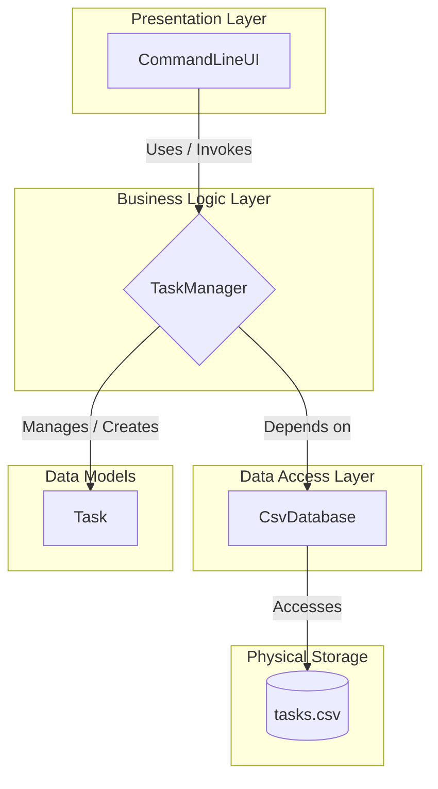

# Terminal Commander: A Python CLI To-Do App

This project is more than just a simple to-do app. It's a practical case study and a benchmark for exploring modern, AI-assisted development workflows. It serves as the primary example for my article, **"Basic Training is Over: The New Role of Developers in the AI War Room."**

The application is a terminal-based task manager built in Python, adhering to OOP, Single Responsibility, and Separation of Concerns principles.

---

## 🚀 Key Features

* **Terminal-Based Interface:** A clean and intuitive command-line UI for all operations.
* **Full CRUD Functionality:** Create, Read (view), Update, and Delete tasks.
* **Persistent Storage:** Utilizes a simple `.csv` file as a database, created and managed automatically.
* **Modular Architecture:** The code is strictly structured to demonstrate a clear separation of concerns (Presentation, Business Logic, Data Access).

## 🏗️ Project Architecture

The application is designed with a multi-tier architecture to ensure maintainability and scalability.


## File Structure

todo-app/
│
├── main.py
├── ui.py
├── task_manager.py
├── database.py
├── models.py
├── config.py
└── todo_db/

## 💡 Development Philosophy & AI Collaboration

This project was intentionally developed using a modern, AI-assisted workflow to serve as a case study. My role was that of a **System Architect**: I defined the project scope, requirements, and software architecture based on SOLID principles.

The initial implementation was then generated by an AI programming assistant (Google Gemini) under my guidance. My responsibilities included the final code review, rigorous testing, and integration to ensure the product meets high-quality standards. This process demonstrates a shift in the developer's role from a "code writer" to a strategic "system designer" who effectively leverages advanced tools.

## 📖 Context & Further Reading

This project and the experience of building it served as the primary catalyst for my article on the evolving role of developers in the AI era. If you are interested in the deeper strategic implications of this workflow, you can read the full article on my website:

* **[Basic Training is Over: The New Role of Developers in the AI War Room](LINK_TO_YOUR_ARTICLE)**

## ⚙️ How to Run

1.  **Clone the Repository:**
    ```bash
    git clone https://github.com/GeorgeFreedomTech/terminal-commander.git
    cd [REPOSITORY_NAME]
    ```
2.  **Create and Activate a Virtual Environment:**
    ```bash
    python -m venv venv
    # On Windows: venv\Scripts\activate
    # On macOS/Linux: source venv/bin/activate
    ```
3.  **Run the Application:**
    *This project uses only standard Python libraries, so no `requirements.txt` is needed for this basic version.*
    ```bash
    python main.py
    ```
4.  Follow the on-screen instructions in your terminal.

## 🔗 Let's Connect:

* Visit my website: **[https://GeorgeFreedom.com](https://GeorgeFreedom.com)**
* Connect on LinkedIn: **[https://www.linkedin.com/in/georgefreedom/](https://www.linkedin.com/in/georgefreedom/)**
* Let's talk: **[https://cal.com/georgefreedom](https://cal.com/georgefreedom)**

## 📜 License:

Copyright (c) 2025 Jiří Svoboda (George Freedom) / George Freedom Tech

This work (educational materials, including text, explanations, exercises, and accompanying code examples within the Jupyter Notebooks) is licensed under:
* Creative Commons Attribution-NonCommercial-ShareAlike 4.0 International License

