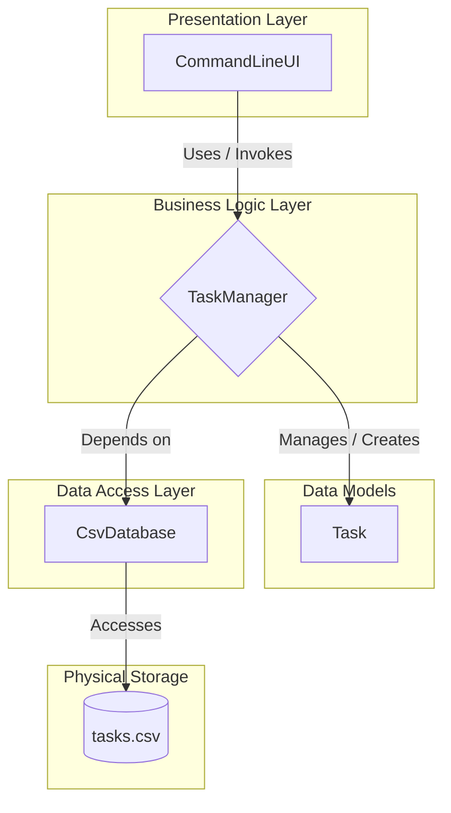

# Terminal-Commander: A Python CLI To-Do App

This project is more than just a simple to-do app. It's a practical case study and a benchmark for exploring modern, AI-assisted development workflows. It serves as the primary example for my article, **"Basic Training is Over: The New Role of Developers in the AI War Room."**

The application is a terminal-based task manager built in Python, adhering to OOP, Single Responsibility, and Separation of Concerns principles.

---

## Key Features

* **Terminal-Based Interface:** A clean, command-line UI for all operations.
* **CRUD Functionality:** Full Create, Read, Update, and Delete operations for tasks.
* **CSV Database:** Utilizes a simple `.csv` file as a persistent data store.
* **Modular Architecture:** The code is structured to demonstrate clear separation of concerns.

## Development Process: The Architect & The AI Implementer

This project was developed to explore and demonstrate a modern workflow where the human's role shifts from a "code writer" to a "system architect."

My role was to define the project scope and requirements, design the software architecture based on SOLID principles, and guide an AI programming assistant (Google Gemini) to generate the initial implementation. I was then responsible for the final code review, testing, and integration to ensure the product meets high-quality standards.

This approach is a testament to a new paradigm in software development: **I am an architect, not a typewriter.** My value is in my ability to think, design systems, and direct advanced tools to achieve goals more effectively.

## Project Architecture

The application is designed with a multi-tier architecture to clearly separate concerns: the User Interface (`ui.py`), Business Logic (`task_manager.py`), Data Models (`models.py`), and Data Access (`database.py`).



### File Structure

```
todo-app/
│
├── todo_db/
│
├── main.py
├── ui.py
├── task_manager.py
├── database.py
├── models.py
├── config.py
│
├── .gitignore
└── README.md
```

## How to Run

1.  **Clone the Repository:**
    ```bash
    git clone https://github.com/GeorgeFreedomTech/terminal-commander.git
    cd terminal-commander
    ```
2.  **Create and Activate a Virtual Environment:**
    ```bash
    python -m venv venv
    # On Windows:
    venv\Scripts\activate
    # On macOS/Linux:
    source venv/bin/activate
    ```
3.  **Run the Application:**
    *This project uses only standard Python libraries, so no `requirements.txt` is needed for this basic version.*
    ```bash
    python main.py
    ```
4.  Follow the on-screen instructions in your terminal.

## 🔗 Let's Connect:

* Visit my website: **[https://GeorgeFreedom.com](https://GeorgeFreedom.com)**
* Connect on LinkedIn: **[https://www.linkedin.com/in/georgefreedom/](https://www.linkedin.com/in/georgefreedom/)**
* Let's talk: **[https://cal.com/georgefreedom](https://cal.com/georgefreedom)**

## 📜 License:

Copyright (c) 2025 Jiří Svoboda (George Freedom) / George Freedom Tech

