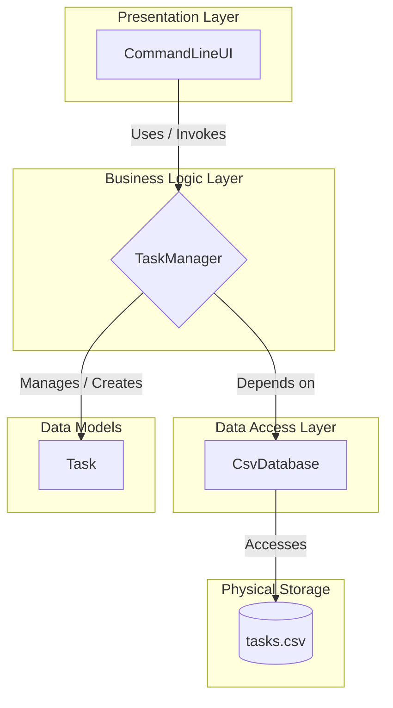

# Terminal Commander: A Python CLI To-Do App

### **By George Freedom**

This repository contains a terminal-based to-do application built in Python. Think of it not just as an app, but as a foundational blueprint or a mission-critical prototype for a larger system.
Its primary purpose is not to be a feature-complete product for daily use, but to serve as a clear case study in architecting resilient software, demonstrating several key concepts:

- Applying **modern software design principles** (OOP, SOLID) – the core engineering needed for any robust autonomous system.

- Utilizing a modern, **AI-assisted workflow** – a simulation of future, rapid development cycles.

- Visualizing **system architecture** using Mermaid diagrams – creating the "holographic blueprint" for our mission.

The project's simplicity (a CSV file as a database, a command-line interface) is a deliberate choice. It strips away distractions to keep the focus purely on the underlying architectural patterns that are scalable to more complex challenges.


## 🚀 Key Features

* **Terminal-Based Interface:** A clean and intuitive command-line UI for all operations.
* **Full CRUD Functionality:** Create, Read (view), Update, and Delete tasks.
* **Persistent Storage:** Utilizes a simple `.csv` file as a database, created and managed automatically.
* **Modular Architecture:** The code is strictly structured to demonstrate a clear separation of concerns (Presentation, Business Logic, Data Access).


## 🏗️ Project Architecture

The application is designed with a multi-tier architecture to ensure maintainability and scalability.




## File Structure
```
app/
│
├── commander_db/
├── main.py
├── ui.py
├── task_manager.py
├── database.py
├── models.py
├── config.py
│
├── README.md
└── LICENSE.md
```


## 💡 Development Philosophy & AI Collaboration

This project was built to test a modern, AI-assisted workflow. My contribution was the architectural design and final quality assurance: I defined the requirements and SOLID principles, guided the AI's implementation, and then performed all code reviews and testing. This approach shifts the developer's value from writing code to designing systems and guaranteeing the result.


## 📖 Context & Further Reading

This project and the experience of building it served as the primary catalyst for my article on the evolving role of developers in the AI era. If you are interested in the deeper strategic implications of this workflow, you can read the full article on my website:

* **[Basic Training is Over: The New Role of Developers in the AI War Room](LINK_TO_YOUR_ARTICLE)**


## ⚙️ How to Run

1.  **Clone the Repository:**
    ```bash
    git clone https://github.com/GeorgeFreedomTech/terminal-commander.git
    cd terminal-commander
    ```
2.  **Create and Activate a Virtual Environment:**
    ```bash
    python -m venv venv
    # On Windows: venv\Scripts\activate
    # On macOS/Linux: source venv/bin/activate
    ```
3.  **Run the Application:**
    *This project uses only standard Python libraries, so no `requirements.txt` is needed for this basic version.*
    ```bash
    python main.py
    ```
4.  Follow the on-screen instructions in your terminal.


## 🔗 Let's Connect:

* Visit my website: **[https://GeorgeFreedom.com](https://GeorgeFreedom.com)**
* Connect on LinkedIn: **[https://www.linkedin.com/in/georgefreedom/](https://www.linkedin.com/in/georgefreedom/)**
* Let's talk: **[https://cal.com/georgefreedom](https://cal.com/georgefreedom)**


## 📜 License:

Copyright (c) 2025 Jiří Svoboda (George Freedom) / George Freedom Tech

This project is licensed under:
* Creative Commons Attribution-NonCommercial-ShareAlike 4.0 International License

---

We build for the Future!
